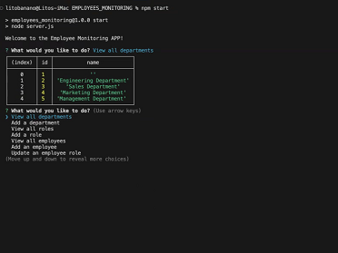

# Employee Monitoring App

Welcome to the Employee Tracker project! This application allows you to manage employees, roles, and departments in a company.

## Screenshot

## Demo Video

Watch the demo video to see the Employee Tracker in action: [Demo Video](https://drive.google.com/file/d/1xn0w-8WB8SdSmGOu8yavOBC8oqbbOpC4/view)

## Getting Started

To get started with the Employee Tracker, follow these steps:

1. Clone the repository: [Repository Link](https://github.com/hyperlitz/EMPLOYEES_MONITORING)
2. Install the required dependencies using `npm install`.
3. Configure the database connection in `db.js`.
4. Run the application using `npm start`.

## Features

- View a list of employees, roles, and departments.
- Add new employees, roles, and departments.
- Update employee roles.
- Delete employees, roles, and departments.

## Usage

1. Run the application and choose an option from the main menu.
2. Follow the prompts to perform actions like adding or updating employees.

## Contributing

Contributions are welcome! If you'd like to contribute to the project, please follow these guidelines:

1. Fork the repository.
2. Create a new branch for your feature or bug fix.
3. Make your changes and commit them.
4. Push your changes to your fork.
5. Create a pull request to the main repository.

## Owner

- Name: Your Name
- GitHub: [HYPERLITZ](https://github.com/hyperlitz)

## License

This project is licensed under the MIT License - see the [LICENSE](LICENSE) file for details.